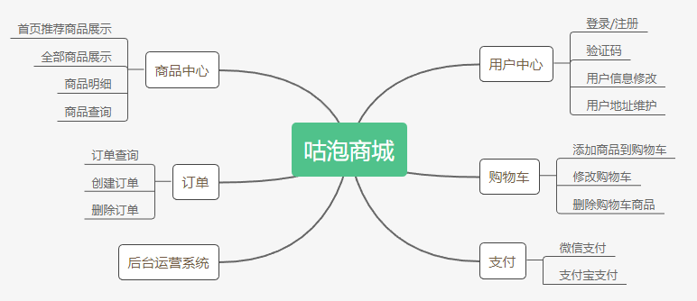

# 产品需求文档


产品需求可以集思广益，有空的同学，或者在做这一块的同学，可以根据现在的产品做一些功能迭代，提供prd文档。


# 需求说明

## 目前已完成的需求



## 后续需求规划

下面是我按照B2B2C的电商功能整理的部分需要，目前只写了平台功能的商品和交易管理部分，稍后我会把会员管理，促销、积分商城、分销、统计、结算、搜索
卖家模块、买家模块的功能完善了。至少希望到用Spring Cloud Alibaba 重构的时候能把这个电商平台变成B2B2C的。

# 平台功能

# 一、商品管理

## 1. 品牌管理

### 功能描述

维护平台所有卖的所有品牌。

### 具体操作

查询、添加、编辑、删除

## 2.规格管理

### 功能描述

管理比如颜色、尺码等此类数据的管理。

### 具体操作

查询、添加、编辑、删除

## 3. 类型管理

### 功能描述

关联品牌、规格，并可以录入查询属性和自定义属性，查询属性在列表页方便用户动态筛选，自定义属性需要商家在录入商品的时候录入对应的数据。

### 具体操作

查询、添加、编辑、删除

## 4. 分类管理

## 功能描述

商城的三级分类，关联类型，在此处录入佣金，根据佣金比例，平台和商家结算时扣除对应的佣金。

### 具体操作

查询、添加、编辑、删除


```markdown
品牌、规格、类型、分类构成商品的基本属性，类型又关联商品的查询属性、自定义属性，这样每一个分类下面的商品属性都是动态可配置的。
```

## 5. 待审核的品牌

## 功能描述

平台录入的品牌不满足商家要求时，商家可以提交品牌给平台进行审核，平台审核通过之后，进入到品牌库中。

### 具体操作

查询、审核


## 6. 商家分类申请

## 功能描述

刚审核通过的商家是不能在分类下面上传商品，商家想在平台哪个三级分类下面上传商品，需要提交平台进行审核，平台根据商家的资质进行审核，审核通过之后商家才能在此分类下面上传商品。

### 具体操作

查询、审核通过、审核失败


## 7. 待售商品

## 功能描述

显示商家提交审核的全部商品，管理员可以审核通过、审核驳回、也可以直接删除商品。

### 具体操作

查询、商品详情、审核通过、审核驳回、删除商品

## 8. 在售商品

## 功能描述

显示全部在销售的商品，并可以对已经销售的商品进行下架、删除操作，也可以对单个商品设置三级分销的佣金。

### 具体操作

查询、删除商品、下架商品、设置佣金 

## 9. 已删除的商品

## 功能描述

采用标记删除，删除之后是不可逆的，已经删除的商品，在用户前端是可以查看的，不过显示此产品已经下架。

### 具体操作

查询

```markdown
共有7个状态来控制商品的上架流程分别是：刚创建、提交审核、审核通过、申请驳回、商品删除、上架、下架，只有处于已上架状态的产品，用户才可能看到商品，各个细节形成一个完整的闭环
```


# 二、交易管理

## 1. 全部订单

### 功能描述

查看所有的订单，并可以打印订单详情，查看订单具体内容，货到付款的订单可以设置为已经收款。

### 具体操作

查询、打印、订单详情、确认收款 

## 2. 未付订单

### 功能描述

显示未付款的订单。

### 具体操作

查询、打印

## 3. 待确认订单

### 功能描述

货到付款的订单是待确认的订单，商家确认操作之后到待发货的订单。

### 具体操作

查询、打印

## 4. 待发货订单

### 功能描述

待发货的订单是付完款和待确认的订单确认之后显示。

### 具体操作

查询、打印

## 5. 已发货订单

### 功能描述

待发货的订单发货之后到已发货的订单。

### 具体操作

查询、打印、确认收款

## 6. 已完成订单

### 功能描述

完成以下2个操作之一，从已发货的订单变成已完成的订单：
1、用户点击确认收货；
2、用户不点击确认收货15个自然日系统定时器由已发货的订单修改为已完成的订单

### 具体操作

查询、打印、确认收款

## 6. 已取消订单

### 功能描述

完成以下2个操作之一，可以变成已取消的订单：
1、用户点击取消；
2、用户未付款24小时系统定时器从未付款的订单变成已取消的订单

### 具体操作

查询

```markdown
订单共有6种基本状态分别是：1、未付款的订单；2、待确认的订单；3、待发货的订单；4、已发货的订单；5、已完成的订单；6、取消的订单。
订单关于库存的处理：
1、加入购物车判断库存，不减库存；
2、提交订单判断库存数量；
3、下单成功减库存；
4、订单取消库存回滚；
```


## 7. 退货管理

### 功能描述

已确认收货的订单可以在15个工作日之内进行退货操作，最终由平台完成退款的操作，具体操作流程：买家申请退货—>商家审核通过或者不予处理—>商家审核通过买家发货—>商家收货收货—>平台退款—>退货完成

### 具体操作

查询、退款


## 8. 换货管理

### 功能描述

换货是商家和用户之间的关联，平台只是查看所有的换货信息，换货的流程是：买家提交换货申请—>卖家审核通过或者不予处理—>卖家审核通过用户发回退件—>卖家收到退件判断是否符合退货申请—>商家发出换件或者原件退还—>不处理—>换货结束

### 具体操作

查询

## 9. 投诉管理

### 功能描述

假如商家不给用户退货换，用户可以提交平台进行申诉，商家也可以提交申诉，最终由平台进行裁决。具体的操作流程是：买家提交投诉申请—>平台审核买家投诉是否通过审核—>平台审核通过之后卖家提交申诉—>平台最终裁定买家申诉通过还是不通过—>卖家申诉不通过强制卖家处理退货换—>卖家申诉通过不处理—>申诉结束

### 具体操作

查询、处理、重置

```
退货换完全按照京东和天猫的方式来做的，审核通过之后商家会录入收货地址，买家邮寄商品也会选择快递公司并输入快递单号
```


# 二、会员管理

## 1. 会员管理

### 功能描述

查看会员产生的各种日志记录，方便进行会员行为的跟踪。

### 具体操作

查询、升级日志、经验值日志、积分值日志、余额日志、收货地址 

## 2. 经验积分管理

### 功能描述

管理员可以动态为会员进行积分和经验值的增加和减少操作

### 具体操作

增加、减少

## 3. 余额管理

### 功能描述

管理员可以动态为会员进行余额的增加和减少操作

### 具体操作

增加、减少

## 4. 会员经验值规则管理

### 功能描述

经验值多少都是动态可配置的，分别在以下几点赠送经验值：1、注册，2、每日登陆，3、订单评价，4、会员购物，并可以设置购物送经验值上线，使用状态也可以开启或者关闭

### 具体操作

设置、启用、停用


## 5. 会员等级配置

### 功能描述

会员共分为5个等级，分别是注册会员、铜牌会员、银牌会员、金牌会员、钻石会员，如铜牌会员经验值设定为500，则当会员的经验值满500后，等级从注册会员提升为铜牌会员

### 具体操作

设置

## 6. 会员积分规则管理

### 功能描述

积分多少都是动态可配置的，分别在以下几点赠送积分：1、注册，2、每日登陆，3、订单评价，4、会员购物，5、积分商城每日签到，并可以设置购物送积分上线，使用状态也可以开启或者关闭

### 具体操作

设置、启用、停用

```
商城系统用户体系一般包括两种：
1.经验值，经验值是用来升级用的，并可以根据用户不同等级设置不同的优惠策略，比如积分商城中等级高的可以兑换高等级的商品；
2.积分，积分是用来消费的，类似京东的京豆，并可以根据后台配置的比例抵扣支付的订单金额，也可以在积分商城兑换商品
```


## 7. 会员充值记录

### 功能描述

前台用户中心有充值功能，可以查看所有会员的充值记录

### 具体操作

查询

## 8. 会员提款申请

### 功能描述

处理会员提款操作，具体业务流程：会员提交审核扣除余额—> 管理员审核通过或者审核失败—>审核失败提款金额回滚—>审核通过打款—>提款完成

### 具体操作

查询、通过、拒绝、已打款


```
会员有一套完整的账户余额体系，账户余额的添加、减少，并且可以使用账户余额进行支付
```


## 9. 会员商品评价管理

### 功能描述

默认商品的评价只有买家自己看到，只有平台审核通过之后其他的买家才能看到评价的内容。

### 具体操作

查询、审核通过、审核不通过

## 10. 会员商品咨询管理

### 功能描述

默认商品的咨询只有买家自己看到，只有平台审核通过之后其他的买家才能看到咨询的内容。

### 具体操作

查询、审核通过、审核不通过


```
平台的管理员能够最细力度的控制前台展示给买家的内容，防止一些买家发布不单言论，对平台造成影响
```


# 三、促销管理

## 1. 优惠券

### 功能描述

优惠券有2中，一种是在线领取，一种线下发放，在线领取可以在单品页看到，线下发放可以导出优惠券。
优惠券的上架流程为：商家新建—>商家提交平台审核—>平台审核通过或者失败—>商家点击上架—>商家下架—>优惠券周期结束。
在发放详情里面可以查看此优惠券有多少用户使用，并可以将之导出。

### 具体操作

查询、审核、发放详情


## 2. 订单满减

### 功能描述

订单满减是商城最常用的促销功能之一，模式是满多少减多少，商城订单满减共分成三个档次，其中第一档必须填写，二、三档可以为空。录入完成之后在单品页展现出来，如“满99减10，满199减20，满499减60”。
订单满减的业务流程：商家新建—>商家提交平台审核—>平台审核通过或者失败—>商家点击上架—>商家下架—>订单满减周期结束。

### 具体操作

查询、审核

## 3. 单品立减

### 功能描述

单品立减是商城最常用的促销功能之一，有2种活动类型，一种是减免金额，一种是折扣立减，一共可以设置20个商品参加活动，您也可以根据自己要求来动态进行调整。
单品立减的业务流程：商家新建—>商家提交平台审核—>平台审核通过或者失败—>商家点击上架—>商家下架—>单品立减周期结束

### 具体操作

查询、详情、审核


```
每一种活动都有渠道的概念，渠道有三种，1、通用；2、PC；3、mobile；设置通用，PC和mobile都可以使用，设置PC只有电脑端可以使用，设置mobile只有手机端可以使用，这样的功能类似我们在京东看到的手机下单才可以享受此优惠，这样做电脑端可以往移动端做引流。
此外，在满足条件的情况下，这三种促销活动可以组合在一起使用，具体使用的顺序是，首先单品立减，购买商品总金额满足订单满减，可以享受订单满减，订单满减减完金额满足使用优惠券，可以继续使用优惠券，这样组合的促销在京东是比较常见的
```


## 4. 每日秒杀

### 功能描述

平台管理员新建每日秒杀—>平台管理员开始商品征集—>商家在各个时间段申请参加每日秒杀的商品—>平台操作征集结束—>平台审核商家申请的商品审核通过的可以在活动当天显示出—>审核完成之后平台管理员点击上架—>当天显示当天的每日秒杀活动。
中途每日秒杀活动中可以下架和作废，其中作废是不可逆的

征集商品状态时商家提交商品，征集结束之后不能在提交商品；

平台可以对任何一个商家的商品进行结束操作，并且可以设置是否推荐、排序权重，这样能更好的控制整点抢购的排序

### 具体操作

查询、新增、修改、删除、作废、审核商品、上架、下架、详情 、征集商品、征集结束、修改排序


```
每日秒杀，是把一天分成几个不同的时间段，每一个时间段显示不同的商品。
1.平台只有点击上架之后所有的商品可以显示出来，并且一天只能上架一个整点抢购；
2.征集商品状态时商家提交商品，征集结束之后不能在提交商品；
3.渠道也是分成了3种，分别是通用、PC、Mobile和其他活动是一样的；
4.平台可以维护整点抢购首页的轮播图；
5.平台可以对任何一个商家的商品进行结束操作，并且可以设置是否推荐、排序权重，这样能更好的控制整点抢购的排序。
```

## 5. 每日秒杀首页轮播图

### 功能描述

可以分别对PC和Mobile上传每日秒杀的图片，并且只有在使用状态下，当前时间大于开始时间小于结束时间状态下才会显示

### 具体操作

查询、新增、修改、删除、使用、停用 


## 6. 团购

- ### 团购首页轮播图

### 功能描述

可以分别对PC和Mobile上传团购的图片，并且只有在使用状态下，当前时间大于开始时间小于结束时间状态下才会显示

### 具体操作

查询、新增、修改、删除、使用、停用 

- ### 团购分类

### 功能描述

维护团购分类，具体的团购挂在团购分类下面，并可以根据团购分类进行查询，新创建的团购分类默认是不使用状态，点击使用之后可以在分类下面上传商品，这样做防止录入错误，直接展示给用户

### 具体操作

查询、新增、修改、删除、使用、停用 

- ### 团购管理

### 功能描述

商家管理员录入参加团购的商品—>商家管理员商品提交审核—>平台审核通过或者审核失败—>审核通过之后商家点击上架—>当前时间大于团购开始时间小于团购结束时间时团购展现出来。
在活动周期内都可以直接结束活动，结束活动之后用户不能够在看到此活动

平台可以对任何一个商家的商品进行结束操作，并且可以设置是否推荐、排序权重，这样能更好的控制团购的排序，还可以录入虚拟的销量。

### 具体操作

查询、编辑、详情、审核通过、审核驳回、结束 

```
团购是单独的价格，单独的库存，在团购频道给用户展示出来：
1.渠道也是分成了3种，分别是通用、PC、Mobile和其他活动是一样的；
2.设置限购数量，设置每一个用户可以购买的数量；
3.活动时间的限制，只有在当前时间并处于上架的活动才会显示出来；
4.可以设置虚拟的销量，这样刚录入的团购会显示有销量，显示的销量是虚拟销量+实际销量；
5.平台可以对任何一个商家的商品进行结束操作，并且可以设置是否推荐、排序权重，这样能更好的控制团购的排序
```


## 7. 拼多多

- ### 拼多多首页轮播图

### 功能描述

可以分别对PC和Mobile上传拼多多频道首页的图片，并且只有在使用状态下，当前时间大于开始时间小于结束时间状态下才会显示

### 具体操作

查询、新增、修改、删除、使用、停用 

- ### 拼多多分类

### 功能描述

维护拼多多分类，具体的拼多多的商品挂在分类下面，并可以根据分类进行查询，新创建的分类默认是不使用状态，点击使用之后才可以在分类下面上传商品，这样做防止录入错误，直接展示给用户

### 具体操作

查询、新增、修改、删除、使用、停用 

- ### 拼多多管理

### 功能描述

商家管理员录入参加拼多多的商品—>商家管理员商品提交审核—>平台审核通过或者审核失败—>审核通过之上商家点击上架—>当前时间大于拼多多商品开始时间小于拼多多结束时间时商品展现出来。
在活动周期内都可以直接结束活动，结束活动之后用户不能够在看到此活动。

平台可以对任何一个商家的商品进行编辑操作，并且可以设置是否推荐、排序权重，这样能更好的控制拼多多商品的排序，还可以录入虚拟的销量。

### 具体操作

查询、编辑、详情、审核通过、审核驳回、结束 


```
根据购买人数的不同决定商品价格的不同，以下几点需要注意：
1.假如不设置阶梯价格，默认就是定金加尾款的模式；
2.有以下几个时间注意区分，分别是活动时间、首付款截止时间、尾款截止时间；
3.渠道也是分成了3种，分别是通用、PC、Mobile和其他活动是一样的；
4.商家提交参加阶梯竞价的产品，由平台审批通过，审批通过之后，商家点击上架之后，才可以在商城展现出来；
5.平台可以维护阶梯竞价的分类已经阶梯竞价首页的轮播图；
6.平台可以对任何一个商家的商品进行结束操作，并且可以设置是否推荐、虚拟销量、排序权重，这样能更好的控制阶梯竞价的排序。
7.购买方式采用定金加尾款的方式，订单购买时候预付定金生成定金订单，活动结束时根据最终的购买人数生成尾款订单。比如商品1000，首付款100，设置10人购买900，20人购买800，活动结束时有20人以上购买则需要付尾款是800-100=700，当然阶梯价格也可以不用设置，类似淘宝、天猫、京东的预售模式，此活动设置是非常灵活的
```


## 8. 积分商城

- ### 积分商城首页轮播图

### 功能描述

可以分别对PC和Mobile上传积分商城频道首页的图片，并且只有在使用状态下，当前时间大于开始时间小于结束时间状态下才会显示

### 具体操作

查询、新增、修改、删除、使用、停用 

- ### 积分商城分类

### 功能描述

维护积分商城分类，具体的积分商城的商品挂在分类下面，并可以根据分类进行查询，新创建的分类默认是不使用状态，点击使用之后方可栏目分类下面上传商品，这样做防止录入错误，直接展示给用户

### 具体操作

查询、新增、修改、删除、使用、停用 

- ### 积分商城管理

### 功能描述

商家管理员录入参加积分商城的商品—>商家管理员商品提交审核—>平台审核通过或者审核失败—>审核通过之上商家点击上架—>当前时间大于商品开始时间小于结束时间时商品展现出来。
在活动周期内都可以直接结束活动，结束活动之后用户不能够在看到此活动。

平台可以对任何一个商家的商品进行编辑操作，并且可以设置是否推荐、排序权重，这样能更好的控制积分商城商品的排序，还可以录入虚拟的销量

### 具体操作

查询、编辑、详情、审核通过、审核驳回、结束 

```
积分商城是使用积分兑换商品，单独的库存，在积分商城频道给用户展示出来：
1.渠道也是分成了3种，分别是通用、PC、Mobile和其他活动是一样的；
2.设置限购数量，设置每一个用户可以兑换的数量；
3.活动时间的限制，只有在当前时间并处于上架的活动才会显示出来；
4.可以设置虚拟的销量，这样刚录入的积分商城商品会显示有销量，显示的销量是虚拟销量+实际销量；
5.平台可以对任何一个商家的商品进行结束操作，并且可以设置是否推荐、排序权重，这样能更好的控制积分商城的排序；
6.可以设置完全积分兑换，也可以设置积分+钱的方式来兑换商品；
7.可以设置兑换积分商城商品会员的等级，只有在制定等级之上（包含制定等级）才可以兑换。
```

## 9. 专题活动

- ### 专题活动首页轮播图

### 功能描述

可以分别对PC和Mobile上传专题活动频道首页的图片，并且只有在使用状态下，当前时间大于开始时间小于结束时间状态下才会显示

### 具体操作

查询、新增、修改、删除、使用、停用 

- ### 专题活动分类

### 功能描述

维护专题活动分类，具体的专题活动的商品挂在分类下面，并可以根据分类进行查询，新创建的分类默认是不使用状态，点击使用之后方可在专题活动栏目分类下面上传商品。这样做防止录入错误，直接展示给用户

### 具体操作

查询、新增、修改、删除、使用、停用 

- ### 专题活动

### 功能描述

平台管理员新建专题活动—>平台管理员点击商品征集—>商家在各个时间段申请参加专题活动的商品—>平台操作征集结束—>平台审核商家申请的商品审核通过—>审核完成之后商家管理员点击上架—>在对应的专题活动显示出来。中途专题活动中可以下架和作废，其中作废是不可逆的

征集商品状态时商家提交商品，征集结束之后不能在提交商品

平台可以对任何一个商家的商品进行结束操作，并且可以设置是否推荐、排序权重，这样能更好的控制专题活动的排序

### 具体操作

查询、新增、修改、删除、作废、审核商品、上架、下架、详情、 征集商品、征集结束、修改排序

```
专题活动是把同一品牌的商品或者同一类型的商品组合在一起，类似唯品会的销售模式。
1.渠道也是分成了3种，分别是通用、PC、Mobile和其他活动是一样的；
2.征集商品状态时商家提交商品，征集结束之后不能在提交商品；
3.活动设置截止时间，在页面关键位置都有倒计时显示；
4.平台可以维护专题活动首页的轮播图；
5.平台可以对任何一个商家的商品进行结束操作，并且可以设置是否推荐、排序权重，这样能更好的控制专题活动的排序；
6.可以设置每一个专题活动的权重和排序，可以动态调整专题活动的显示顺序。

```


