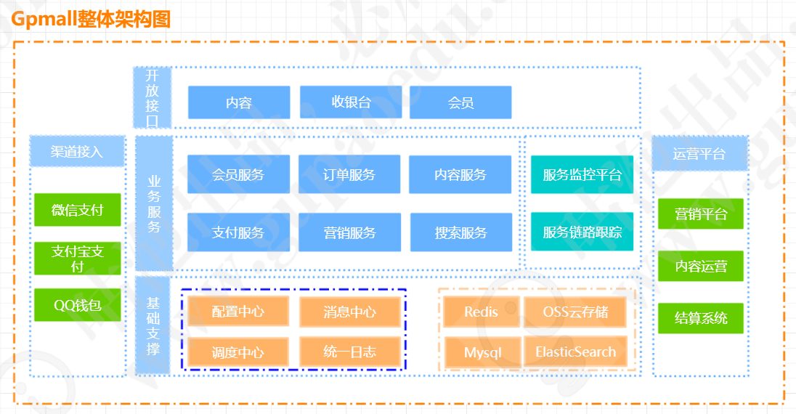
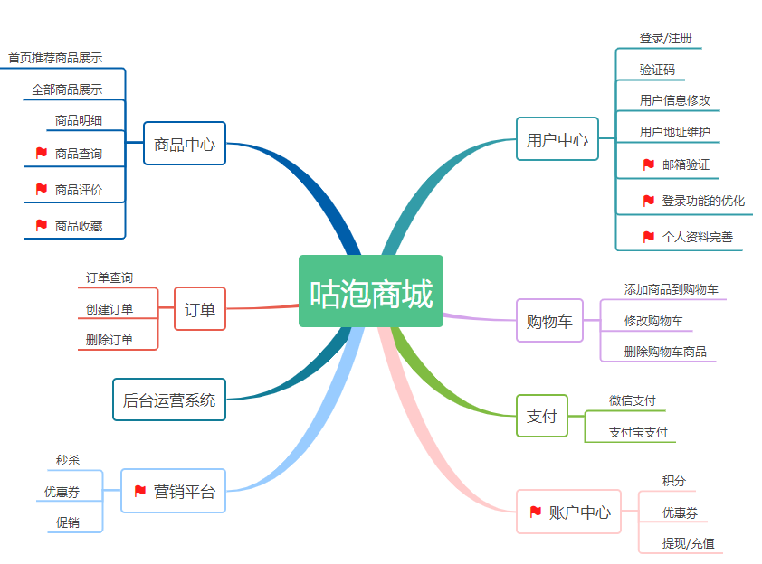

# GPMall 电商网站

很多学员苦恼于没接触过分布式项目，希望有一些完整的项目来落地。所以我抽空给大家开发了一个微服务架构的电商网站，有兴趣的同学，可以私聊我一起参与项目的开发。

为了更好的体现在互联网公司项目的完整性，我对模块做了非常细的拆分，并没有使用maven多模块来管理项目，所以大家在部署的时候会一些麻烦

# 应用架构图

## 项目演示地址

* 前台：
* 后台：

# 项目用到的技术

项目采用前后端分离开发，前端需要独立部署。目前核心的技术栈采用的是SpringBoot2.1.5.RELEASE+Dubbo2.7.2,  

## 前端使用的技术

* nodejs
* axios
* es6
* vue
* sass
* Element UI
* webpack
* vue router
* mockjs

## 后端使用的技术

后端的主要架构是基于springboot+dubbo+mybatis.

* SpringBoot2.1.6
* Mybatis
* Dubbo2.7.2
* Zookeeper
* Mysql
* Redis
* Elasticsearch
* Kafka
* druid
* Docker
* mybatis generator
* Sentinel

# 项目模块说明

| db_script  本项目的数据库脚本                                | 使用mysql | 暂时未做分表处理，不过有考虑到分表的情况             |
| ------------------------------------------------------------ | --------- | ---------------------------------------------------- |
| gpmall-cashier 收银台，负责支付相关的交互逻辑                | web项目   | 8083端口                                             |
| gpmall-commons 公共的组件                                    | jar       | 公共组件，很多地方都有引用，改动的时候要注意         |
| gpmall-front  咕泡商城的前端项目                             | 前端项目  | 使用vue、node、es等前端技术开发                      |
| gpmall-parent 父控文件，用来统一管理所有jar包                | 父控文件  | 用来统一管理所有项目的jar包的版本                    |
| gpmall-shopping  商品/购物车/首页渲染等交互                  | web项目   | 8081端口                                             |
| gpmall-user  提供用户相关的交互，如登录、注册、个人中心等    | web项目   | 8082端口                                             |
| market-service 促销活动的Dubbo服务【暂时未联调完成，可以不启动】 | dubbo服务 | 20884端口                                            |
| pay-service  提供支付处理能力                                | dubbo服务 | 20883端口                                            |
| shopping-service，提供购物车、推荐商品、商品等服务           | dubbo服务 | 20881端口                                            |
| user-service ，提供用户相关服务                              | dubbo服务 | 20880端口                                            |
| order-service ，提供订单服务                                 | dubbo服务 | 20882端口                                            |
| PRD                                                          |           | 存放prd需求文档，有想参与设计的同学，可以提供prd需求 |
| wiki                                                         |           | 帮助文档，需要每一位同学贡献自己的一份力量           |

# 部署说明

模块比较多，部署这块会比较复杂。由于没有远程私服的支持，所以都需要本地先构建才能运行

1. 提前把环境准备好，zookeeper、mysql、redis、kafka(暂时没用到)等
2. gpmall-parent 是一个父控文件，需要先install到本地仓库
3. gpmall-commons 公共组件，第二步结束之后执行install安装
4. 把所有dubbo服务的api全部install到本地仓库
5. 分别启动gpmall-user/gpmall-shopping.  如果在同一个机器运行，需要指定不同的端口

# 前端项目启动流程

前端项目依赖node，所以需要先安装node环境

1. 去node官网下载nodejs安装文件进行安装，如果在`cmd`中输入 npm -version 能够显示版本，说明安装成功
2. 进入gpmall-front , 执行npm install
3. 第二步成功之后，执行npm  run dev 启动前端项目

# 项目开发进度

## 前台项目整体的规划有

* 首页渲染，轮播、自定义展示板块
* 商品查询、商品展示、商品详情
* 个人中心、用户注册、个人信息修改、收获地址维护
* 购物车、订单查询、下单、支付
* 促销活动

## 后台规划

后台这块我会搭建一个框架，有兴趣的同学可以参与开发，主要是提供对于前端相关模块的配置

# 项目架构图

# 如何贡献

非常欢迎您对Gpmall的开发作出贡献！ 你可以选择以下方式向Gpmall贡献：

- [Github - 发布issue进行问题反馈和建议](https://github.com/2227324689/gpmall/issues)
- 通过Pull Request提交修复
- 完善文档
- 提交产品需求

# 技术交流及问题解答

>  **助理** （一个程序员竟然有助理，不可思议）

>  qq交流群

>  作者的个人博客

http://istio.tech

