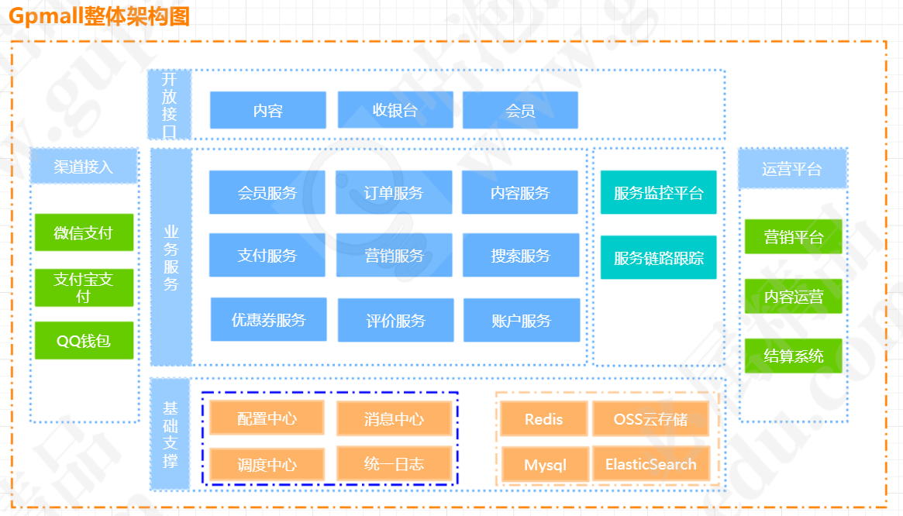

        

# 咕泡商城- 微服务架构实战

咕泡商城是[咕泡学院](https://www.gupaoedu.com) Java架构课程中，帮助学员对于技术更好落地的一个实战项目，项目基于springboot2.1.6.RELEASE+Dubbo2.7.3 来构建微服务。

业务模块划分，尽量贴合互联网公司的架构体系。所以，除了业务本身的复杂度不是很高之外，整体的架构基本和实际架构相差无几。

但实际上，真实的生产级的项目由于用户量以及业务的复杂度，会变得非常复杂。 所以我们会让更多的人参与进来，从需求、设计、解决方案等方面出发来对项目进行迭代，从而培养出一定的

实际解决方案的经验和能力。

# 应用架构图

## 项目演示地址

* 商场系统演示地址：http://vip.istio.tech（暂时不可用）
* 后台管理系统：开发中..

# 项目用到的技术

项目采用前后端分离开发，前端需要独立部署。目前核心的技术栈采用的是SpringBoot2.1.5.RELEASE+Dubbo2.7.2,  

## 前端使用的技术

* nodejs
* axios
* es6
* vue
* sass
* Element UI
* webpack
* vue router
* mockjs

## 后端使用的技术

后端的主要架构是基于springboot+dubbo+mybatis.

* SpringBoot2.1.6
* Mybatis
* Dubbo2.7.2
* Zookeeper
* Mysql
* Redis
* Elasticsearch
* Kafka
* druid
* Docker
* mybatis generator
* Sentinel

# 项目模块说明

| db_script  本项目的数据库脚本                                | 使用mysql | 暂时未做分表处理，不过有考虑到分表的情况             |
| ------------------------------------------------------------ | --------- | ---------------------------------------------------- |
| gpmall-cashier 收银台，负责支付相关的交互逻辑                | web项目   | 8083端口                                             |
| gpmall-commons 公共的组件                                    | jar       | 公共组件，很多地方都有引用，改动的时候要注意         |
| gpmall-front  咕泡商城的前端项目                             | 前端项目  | 使用vue、node、es等前端技术开发                      |
| gpmall-parent 父控文件，用来统一管理所有jar包                | 父控文件  | 用来统一管理所有项目的jar包的版本                    |
| gpmall-shopping  商品/购物车/首页渲染等交互                  | web项目   | 8081端口                                             |
| gpmall-user  提供用户相关的交互，如登录、注册、个人中心等    | web项目   | 8082端口                                             |
| market-service 促销活动的Dubbo服务【暂时未联调完成，可以不启动】 | dubbo服务 | 20884端口                                            |
| pay-service  提供支付处理能力                                | dubbo服务 | 20883端口                                            |
| shopping-service，提供购物车、推荐商品、商品等服务           | dubbo服务 | 20881端口                                            |
| user-service ，提供用户相关服务                              | dubbo服务 | 20880端口                                            |
| order-service ，提供订单服务                                 | dubbo服务 | 20882端口                                            |
| comment-service , 商品评论服务                               | dubbo服务 | 20885端口                                            |
| PRD                                                          |           | 存放prd需求文档，有想参与设计的同学，可以提供prd需求 |
| wiki                                                         |           | 帮助文档，需要每一位同学贡献自己的一份力量           |

# 项目搭建方式

1. 创建gpmall数据库，并把`db_scrpit`目录下的sql脚本导入。

2. 按照下面顺序分别启动相关服务

   * gpmall-parent , 这个是整个项目的父控文件，需要执行install安装到本地，如果自己搭建了nexus，可以deploy到nexus上

   * gpmall-commons ， 这个是整个项目的公共依赖，执行install安装到本地，如果自己搭建了nexus，可以deploy到nexus上

     > 注： 下列微服务，用到了mysql、redis、kafka等，需要提前安装好相关中间件，并且所有的服务配置的是host地址，建议用hostswitch工具统一维护

   * user-service ,  用户服务，把`user-service-api`模块，install到本地仓库，因为其他模块有依赖。然后启动服务。

   * order-service , 订单服务， 把`order-service-api`模块，install到本地，给其他模块依赖

   * shopping-service , 商品服务， 把`shopping-service-api`模块，install到本地，给其他模块依赖

   * marking-service , 营销服务，暂时未开发功能。

   * pay-service , 支付服务，代码已经写完并调试通过（但是用的是老的接口版本，如果是新的版本，需要改接口），还需要提供appid这些，不过这个项目不启动，并不影响前面的页面的功能

   * comment-service , 评论服务，用于展示商品评论信息

     > 下面的服务为BFF，做服务聚合，分别依赖上面的微服务模块

   * gpmall-shopping 

   * gpmall-user

   * gpmall-cashier 

3. 前端工程 gpmall-front， 这个项目采用vue开发。

   1. 安装node环境
   2. 安装python2.7
   3. 在gpmall-front中执行`npm install` ，
   4. 再执行`npm run dev`运行，  如果后端的服务都正常启动，此时gpmall-front会把请求转发到服务端获取相关数据进行渲染。

# 项目开发进度

## 前台项目整体的规划有

* 首页渲染，轮播、自定义展示板块
* 商品查询、商品展示、商品详情
* 个人中心、用户注册、个人信息修改、收获地址维护
* 购物车、订单查询、下单、支付
* 促销活动

## 后台规划

# 效果图

# 项目架构图

# 如何贡献

非常欢迎您对Gpmall的开发作出贡献！ 你可以选择以下方式向Gpmall贡献：

- [Github - 发布issue进行问题反馈和建议](https://github.com/2227324689/gpmall/issues)
- 通过Pull Request提交修复
- 完善文档
- 提交产品需求

<<<<<<< HEAD
# 
=======
# 个人微信公众号

>>>>>>> 88aab362053f002aeff65bb3c957591fafb1c788

>  作者的个人博客

https://istio.tech

