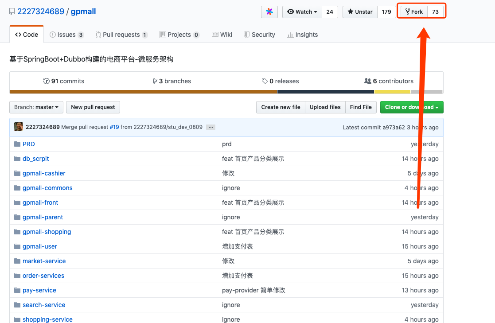
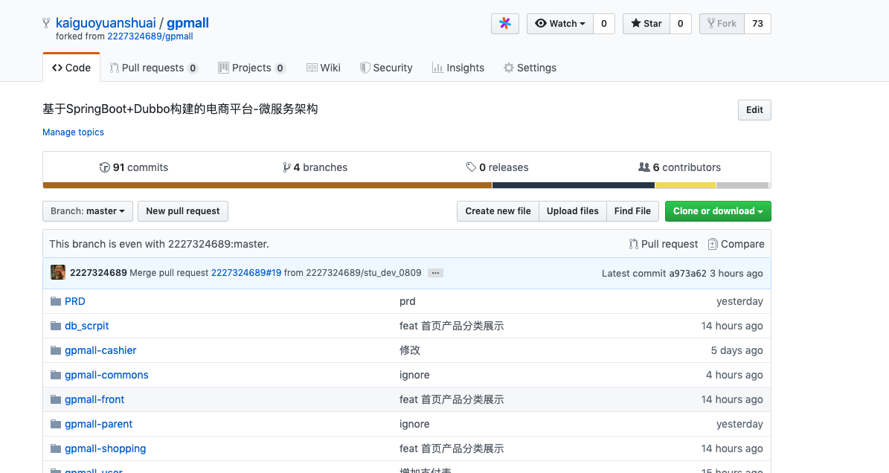
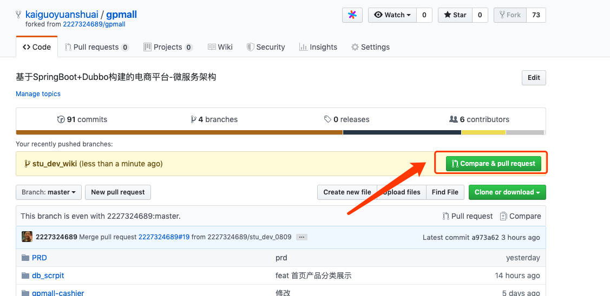
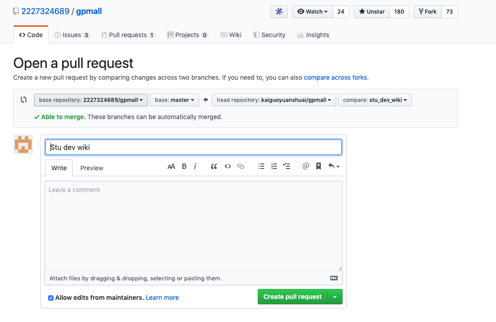
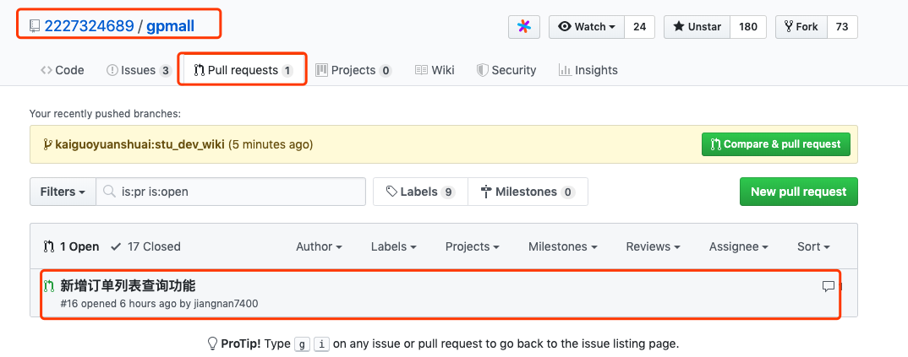
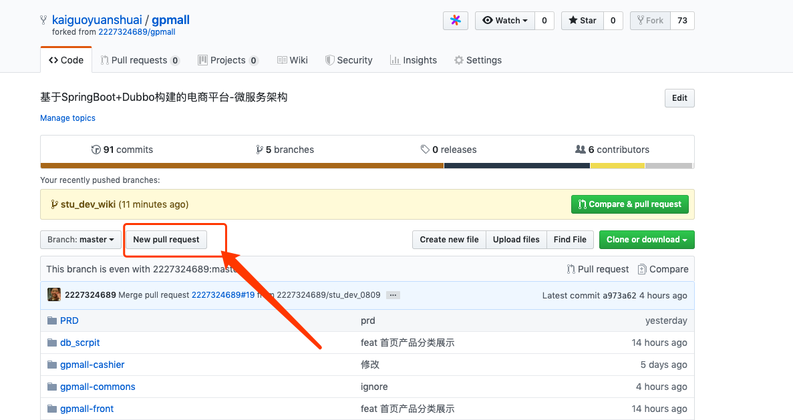
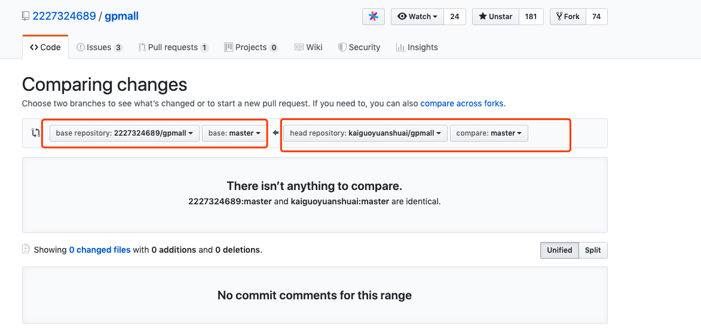

## 如何提交代码到 gpmall 
### 1.克隆 
 - 打开  [项目地址](https://github.com/2227324689/gpmall) ,点击右边的 fork 
  
  
 - clone 自己fork后的代码
 
 ### 2.编写代码并提交到自己仓库
 - coding and commit and push a new branch  
 
 ### 3. 发起request 
 - pull request 
 
 
 - 选择分支 、编写 comment 
 
  
 
 
 ### 4. 等待合并代码 
 在源项目中可以看到自己提交的请求 
 
 
 ### 5. 更新 源仓库中最新的代码 
 在fork的项目中发起一个pull request 
 
 
 
 
 
 注意选择方向，是从源仓库合并到fork仓库
 
 
 ## 其他 
  - 编写`comment` 最好详细一点  
  - 需要实时更新最新代码，避免代码过于老旧
  