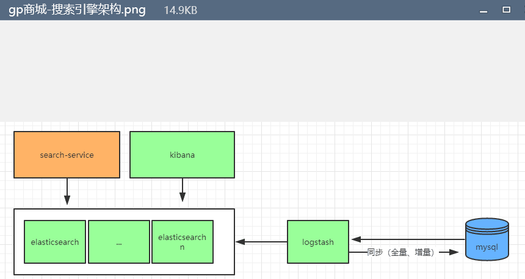

#搜索功能
####主要提供于商品搜索功能

####主要架构图


####环境搭建
 环境搭建使用到了docker,需要对docker有个基本了解 
 docker环境,及其他基本环境搭建 eg jdk mysql  等等
 
 ELK是Elasticsearch、Logstash、Kibana的简称，这三者是核心套件，但并非全部。
 
 Elasticsearch是实时全文搜索和分析引擎，提供搜集、分析、存储数据三大功能；是一套开放REST和JAVA API等结构提供高效搜索功能，可扩展的分布式系统。它构建于Apache Lucene搜索引擎库之上。
 
 Logstash是一个用来搜集、分析、过滤日志的工具。它支持几乎任何类型的日志，包括系统日志、错误日志和自定义应用程序日志。它可以从许多来源接收日志，这些来源包括 syslog、消息传递（例如 RabbitMQ）和JMX，它能够以多种方式输出数据，包括电子邮件、websockets和Elasticsearch。
 
 Kibana是一个基于Web的图形界面，用于搜索、分析和可视化存储在 Elasticsearch指标中的日志数据。它利用Elasticsearch的REST接口来检索数据，不仅允许用户创建他们自己的数据的定制仪表板视图，还允许他们以特殊的方式查询和过滤数据
 
 docker search命令搜索需要下载的镜像
 例如 docker search elasticsearch 搜索的es版本默认是最新的 如需要查看es其他版本 到https://hub.docker.com/ 进行搜索 例如搜索到的es版本

 选择镜像版本 docker pull elasticsearch:6.8.2 直接拉取的es就是6.8.2分支
 然后进行启动镜像 Logstash (官方安装手册:https://www.elastic.co/guide/en/logstash/current/installing-logstash.html) Kibana(官方安装手册:https://www.elastic.co/guide/en/kibana/current/install.html)
 同理 我们因为使用logstach (这里使用的镜像是logstash-input-jdbc-mysql:6.6.0)来从数据库拉取数据 全量或者增量记录到es
 
 es配置
 ```xml
 #docker集群节点名称
 cluster.name: "docker-cluster"
 network.host: 0.0.0.0
 logstash-input-jdbc-mysql 配置
 
 ```xml
 input {
         jdbc {
                 jdbc_driver_library => "mysql连接jar包"
                 jdbc_driver_class => "com.mysql.jdbc.Driver"
                 jdbc_connection_string => "jdbc:mysql://数据库地址及数据库?useUnicode=true&characterEncoding=utf8&useSSL=false"
                 jdbc_user => "数据库账号"
                 jdbc_password => "数据库密码"
                 schedule => "* * * * *"
                 jdbc_paging_enabled => true
                 statement => "select * from tb_item"
         }
         jdbc {
                 jdbc_driver_library => "mysql连接jar包"
                 jdbc_driver_class => "com.mysql.jdbc.Driver"
                 jdbc_connection_string => "jdbc:mysql://数据库地址及数据库?useUnicode=true&characterEncoding=utf8&useSSL=false"
                 jdbc_user => "数据库账号"
                 jdbc_password => "数据库密码"
                 schedule => "* * * * *"
                 jdbc_paging_enabled => true
                 #执行语句
                 statement => "select * from tb_item where updated > :sql_last_value"
                 #使用数据库表的列
                 use_column_value => true
                 tracking_column => "updated"
                 tracking_column_type => "timestamp"
                 #这是存放上一次执行之后id的值
                 last_run_metadata_path => "lastUpdated.txt"
         }
 }
 
 output {
         #输入es地址
         elasticsearch {
             hosts => ["172.26.43.37:9200"]
             # 索引名字，必须小写
             index => "tb_item"
             # 数据唯一索引
             document_id => "%{id}"
         }
         stdout { codec => json_lines }
 }
 Kibana配置
 ~     
 ```xml
 # Default Kibana configuration for docker target
 server.name: kibana
 server.host: "0"
 elasticsearch.url: "es地址http://xxx:1010"
 xpack.monitoring.ui.container.elasticsearch.enabled: true
 i18n.locale: "zh-CN"     
  
 ###docker中的配置文件
 1.在docker容器的目录下进行修改 修改配置后需要重启容器 进入容器目录 docker exec -it 容器ID /bin/bash
 2.从服务器目前配置elk 的配置文件在讲此文件 挂载到容器对应目录下 docker run -d -p 8001:8001 -v /usr/local/develope/tomcat/one:/usr/local/tomcat tomcat (例如将本机Tomcat 挂在到容器的对应tomcat目录下) 
                                     

  
 es简介
 ElasticSearch是一个基于Lucene的搜索服务器。它提供了一个分布式多用户能力的全文搜索引擎，基于RESTful web接口。
 Elasticsearch是用Java语言开发的，并作为Apache许可条款下的开放源码发布，是一种流行的企业级搜索引擎。
 ElasticSearch用于云计算中，能够达到实时搜索，稳定，可靠，快速，安装使用方便。官方客户端在Java、.NET（C#）、PHP、
 Python、Apache Groovy、Ruby和许多其他语言中都是可用的。根据DB-Engines的排名显示，Elasticsearch是最受欢迎的
 企业搜索引擎，其次是Apache Solr，也是基于Lucene。
  
 ElasticSearch 是一个分布式、高扩展、高实时的搜索与数据分析引擎。它能很方便的使大量数据具有搜索
 、分析和探索的能力。充分利用ElasticSearch的水平伸缩性，能使数据在生产环境变得更有价值。
 ElasticSearch 的实现原理主要分为以下几个步骤，首先用户将数据提交到Elastic Search 数据库中，
 再通过分词控制器去将对应的语句分词，将其权重和分词结果一并存入数据，当用户搜索数据时候，再根据权重将结果排名，打分，再将返回结果呈现给用户。
 
 Elasticsearch是与名为Logstash的数据收集和日志解析引擎以及名为Kibana的分析和可视化平台一起开发的。
 这三个产品被设计成一个集成解决方案，称为“Elastic Stack”（以前称为“ELK stack”）。
 Elasticsearch可以用于搜索各种文档。它提供可扩展的搜索，具有接近实时的搜索，并支持多租户。
 ”Elasticsearch是分布式的，这意味着索引可以被分成分片，每个分片可以有0个或多个副本。
 每个节点托管一个或多个分片，并充当协调器将操作委托给正确的分片。再平衡和路由是自动完成的。
 “相关数据通常存储在同一个索引中，该索引由一个或多个主分片和零个或多个复制分片组成。
 一旦创建了索引，就不能更改主分片的数量。
 Elasticsearch使用Lucene，并试图通过JSON和Java API提供其所有特性。它支持facetting和percolating，
 如果新文档与注册查询匹配，这对于通知非常有用。另一个特性称为“网关”，处理索引的长期持久性；
 例如，在服务器崩溃的情况下，可以从网关恢复索引。Elasticsearch支持实时GET请求，适合作为NoSQL数据存储，但缺少分布式事务
 基础入门教程见https://www.yiibai.com/elasticsearch/elasticsearch-getting-start.html
 高级应用待补充...